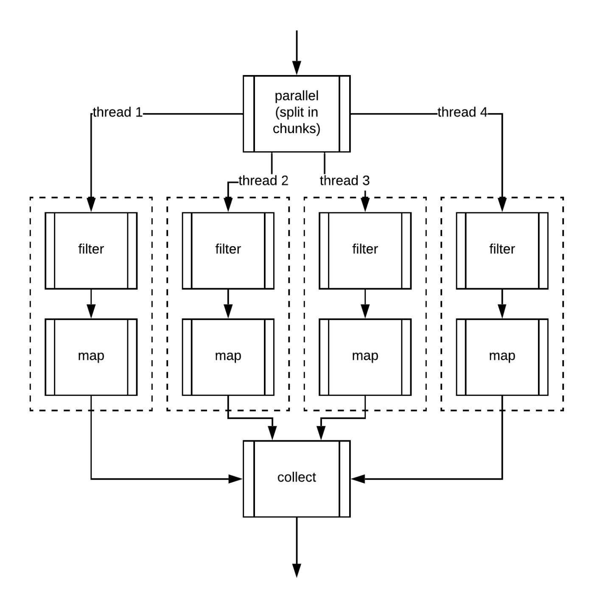
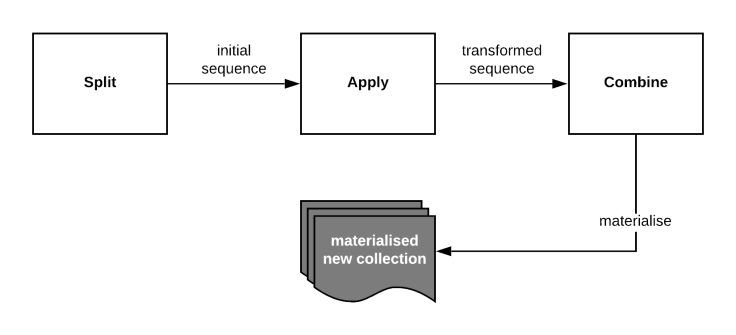
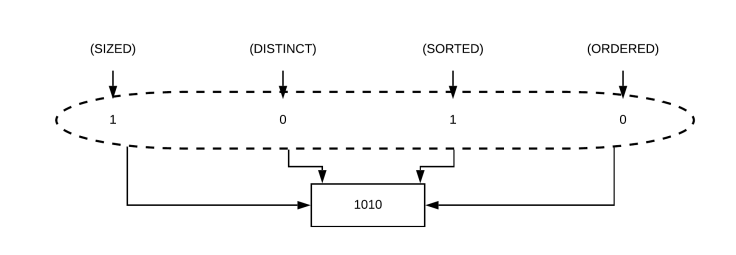

# Introduction
- Root reference: https://docs.oracle.com/javase/8/docs/api/java/util/stream/package-summary.html
# Topics
- [What is Java Stream](#what-is-java-stream)
- [Why is Java Stream?](#why-is-java-stream)
- [Java Streams as a series of connected pipes](#java-streams-as-a-series-of-connected-pipes)
- [Stream internals](#stream-internals)

## What is Java Stream?

  - Java Streams are basically a pipeline of aggregate operations that can be applied to process a sequence of elements
  - An aggregate operation is a higher-order function that receives a behaviour in a form of a function or lambda, and that behaviour is what gets applied to our sequence.
  - The central API class is the Stream<T>.

  

### The classes Stream, IntStream, LongStream, and DoubleStream are streams over objects and the primitive int, long and double types. Streams differ from collections in several ways:
  - Is not a data structure that stores elements;
  - Functional in nature.
  - An operation on a stream produces a result, but does not modify its source.
  - Laziness-seeking.
  - Possibly unbounded.
  - Consumable.

## Why is Java Stream?
### Declarative paradigm
  - Streams are written specifying what has to be done, but not how.
### Lazily evaluated
  - This basically means that until we call a **terminal operation**, our stream won’t be doing anything, we will just have declared what our pipeline will be doing.
### It can be consumed only once
  - Once we call a terminal operation, a new stream would have to be generated in order to apply the same series of aggregate operations.
### Can be parallelised
  - Java Streams are sequential by default, but they can be very easily parallelised.

## Java Streams as a series of connected pipes
- Where in each pipe our data gets processed differently; this concept is very similar to UNIX pipes!
### Phases of a stream


- They won’t get executed until we call our terminal operation.
- There are two main interfaces of Java in Stream we should take care:
  - Spliterator
    - Iterating
    - The potential splitting of elements.
      - Splitting will take a big importance when running parallel streams as it’ll be the one responsible for splitting the stream to give an independent “piece of work” to each thread.
  - Collector

## Stream internals
- Java Streams operations are stored internally using a LinkedList structure and in its internal storage structure, each stage gets assigned a bitmap that follows this structure:
- You can take a look at: StreamOpFlag



### This is what bitmap representation allows Java is to do stream optimisations.
- Example:
  - map -> clear SORTED and DISTINCT bits because data may have changed **BUT** always preserve SIZED flag as the size of the stream will never be modified using map.
  - filter -> clear SIZED flag because size of the stream may have changed, but it’ll always preserve SORTED and DISTINCT flags because filter will never modify the structure of the data.

### So how does the Stream use these flags for its own benefit?
- So each operation combines the flags from the previous stage with its own flags, generating a new set of flags.
- Java Streams are able to make transparent optimisations to our Streams

### Execution
- Lazily executed -> when a terminal operation: `Collector` get executed and what happened is that the Stream selects an execution plan.
- Two main scenarios:
  - Stateless
    - A stateless operation doesn’t need to know about any other element to be able to emit a result. Examples of stateless operations are: filter, map or flatMap.
  - NOT all stages are stateless.
    - Stateful operations may need to process the entire input before producing a result. For example, one cannot produce any results from sorting a stream until one has seen all elements of the stream. As a result, under parallel computation, some pipelines containing stateful intermediate operations may require multiple passes on the data or may need to buffer significant data.
    - For ordered streams, the selection of distinct elements is stable (for duplicated elements, the element appearing first in the encounter order is preserved.) For unordered streams, no stability guarantees are made.
    - For sequential streams, when this stream is sorted, the only element checked is the previous, when is not sorted a HashSet is used internally instead, for this reason executing distinct after sort results in a better performance.

The "full barrier operation" means that all the upstream operations must be performed before the downstream can start.
```java
    class X {
        public void static main() {
          Stream<Integer> stream = Stream.of(2,1,3,5,3)
                  .sorted()
                  .distinct()
                  .peek(i -> System.out.println("distinct: "+i));
        }
    }
```
- If all operations are stateless -> the Stream can be processed in one go
- If it contains stateful operations -> the pipeline is divided into sections using the stateful operations as delimiters.

### Short-circuiting terminal operations
- You can see something like: limit, findFirst, findAny, anyMatch, allMatch or noneMatch
